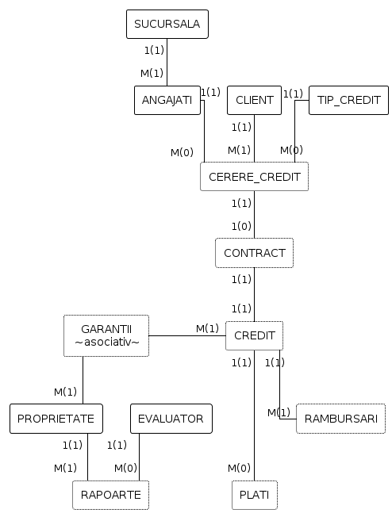
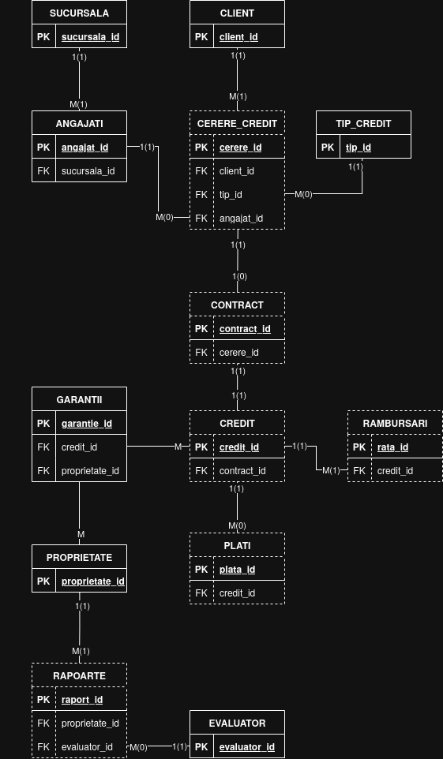

# Cuprins

- [1. Descrierea modelului real, a utilității acestuia și a regulilor de funcționare](#1)
- [2. Prezentarea constrângerilor (restricții, reguli) impuse asupra modelului](#2)
- [3. Descrierea entităților, incluzând precizarea cheii primare](#3)
- [4. Descrierea relațiilor, incluzând precizarea cardinalității acestora](#4)
- [5. Descrierea atributelor, incluzând tipul de date și eventualele constrângeri](#5)
- [6. Realizarea diagramei entitate-relație corespunzătoare descrierii de la punctele 3-5](#6)
- [7. Realizarea diagramei conceptuale corespunzătoare diagramei entitate-relație](#7)
- [8. Enumerarea schemelor relaționale corespunzătoare diagramei conceptuale](#8)
- [9. Crearea tabelelor și a secvențelor SQL](#9)
- [10. Inserarea datelor](#10)
- [11. Cereri SQL](#11)
- [12. Operatii de actualizare](#12)

# Sistem de Credite Ipotecare

<span id="1"> 

1. **Descrierea modelului real, a utilității acestuia și a regulilor de funcționare.**

    - Sistem destinat deschiderii, procesarii si gestionarii creditelor ipotecare.
    - Un client poate crea o cerere de credit in orice sucursala a firmei, cu ajutorul unui angajat, pe baza unei proprietati imobiliare. Aceasta cerere este procesata iar proprietatea este evaluata de un evaluator. Evaluatorul va scrie un raport de evaluare ce va fi asociat proprietati.
    - Odata cu aprobarea cererii, clientul se va prezenta pentru a incheia contractul de credit. In baza contractului se va stabili graficul de rambursare.
    - Dupa ce contractul este finalizat, este deschis un cont de credit asociat contractului.
    - Clientii pot fi atat persoane fizice cat si institutii/firme. Pentru crearea unei cereri de credit, individul/reprezentantul va fi nevoit sa completeze o serie de informatii:  nume prenume/nume firma, CNP/CUI, venit anual/cifra de afaceri, garantiile oferite, cont bancar.

    
<span id="2"> 

2. **Prezentarea constrângerilor (restricții, reguli) impuse asupra modelului.**
    
    - Un client are nevoie de minim o proprietate oferita ca garantie.
    - Toate campurile din fisa cererii sunt obligatorii.
    - O cerere poate fi creata doar daca este asociata unui angajat autorizat si unei sucursale.
    - Un contract poate fi intocmit doar prin existenta unei cereri de credit aprobat.
    - Valorarea creditului nu trebuie sa depaseasca valoarea garantiei.
    - Un raport de evaluare poate fi creat doar de un evaluator.
    - Raportul de evauare poate fi asociat doar unei proprietati
    - O garantie poate fi formata din mai multe proprietati.
    - O proprietate poate fi folosita doar intr-o singura garantie asociata unui credit activ.
    - Un contract poate avea asociat doar un singur credit.
    - O plata poate fi asociata doar unui singur credit. Un credit poate avea mai multe plati.
    - Data semnării contractului trebuie să fie mai mare sau egală cu data depunerii cererii de credit.
    - Suma totală plătită (din tabelul PLATI) nu poate depăși suma acordată plus dobânda calculată în CONTRACT.
    - Doua proprietati nu pot avea aceasi adresa.

    ---

<span id="3"> 

3. **Descrierea entităților, incluzând precizarea cheii primare.**
    
    1. CLIENTI
        * Persoana fizica/firma ce beneficiaza de credit.
        * PK: `client_id`
    2. TIPURI_CREDIT
        * Pachetele de credit oferite de firma 
        * PK: `tip_credit_id` 
    3. CERERI_CREDIT
        * Cererile de credit
        * PK: `cerere_credit_id`
    4. CONTRACTE
        * Contractele de credit
        * PK: `contract_id`
    5. CREDITE
        * Contul de credit oferit
        * PK: `credit_id`
    6. PLATI
        * Platile realizate de client
        * PK: `plata_id`
    7. PROPRIETATI
        * imobiliarele oferite drept garantie
        * PK: `proprietate_id`
    8. EVALUATOR
        * Persoana responsabila pentru evaluarea proprietatilor
        * PK: `evaluator_id`
    9. RAPOARTE_EVALUARE
        * Raportul de evaluare a valorii proprietatilor
        * PK: `raport_evaluare_id`
    10. ANGAJATI
        * Reprezentant al sucursalei ce se ocupa de intocmirea si aprobarea cererilor
        * PK: `angajat_id`
    11. SUCURSALE
        * Sediu al firmei de credite ipotecare
        * PK: `sucursala_id`
    12. GARANTII
        * Lista a proprietatilor pe baza carora se ofera creditul
        * PK: `garantie_id`
    13. GRAFIC DE RAMBURSARI
        * Planul de plati pe care clientul este responsabil sa le efectueze
        * Tabel asociativ CREDITE - PROPRIETATI
        * PK: `grafic_rambursari_id`
        
    ---

<span id="4"> 

4. **Descrierea relațiilor, incluzând precizarea cardinalității acestora.**
    
| RELATIE                  | CARDINALITATE                         | OBSERVATII     |
| :---:                    | :---:                                 | :---:          |
| personal                 | Sucursala - Angajati 1(1):M(1)        |                |
| are_cereri               | Client - Cereri Credit 1(1):M(1)      |                |
| gestioneaza_cererile     | Angajati - Cereri Credit 1(1):M(0)    |                |
| cereri_de_tip            | Tip Cerere - Cereri Credit 1(1):M(0)  |                |
| rapoarte                 | Evaluator - Rapoarte 1(1):M(0)        |                |
| evaluat                  | Proprietate - Rapoarte 1(1):M(1)      |                |
| tranzactii               | Credit - Plati 1(1):M(0)              |                |
| plan_rambursari          | Credit - Rambursari 1(1):M(1)         |                |
| garantii                 | Credite - Proprietati M(1):M(1)       |                |
| incheiat                 | Cerere Credit - Contract 1(1):1(0)    |                | 
| asociat_creditului       | Contract - Credit 1(1):1(1)           |                | 

---

<span id="5"> 

5. **Descrierea atributelor, incluzând tipul de date și eventualele constrângeri, valori
implicite, valori posibile ale atributelor.**

* CLIENT
    
| ATRIBUT | TIP DE DATE | CONSTRANGERI | VALORI POSIBILE | VALORI IMPLICITE | OBSERVATII |
| :--- | :--- | :--- | :--- | :--- | :--- |
| **client_id** | NUMBER(13) | PK | | ||
| **tip_client** | VARCHAR2(2) | CHECK | 'PF', 'PJ' | 'PF' ||
| **nume_denumire** | VARCHAR2(100) | NOT NULL | | ||
| **cod_identificare**| VARCHAR2(13) | UNIQUE, NOT NULL | | |CNP/CUI|
| **adresa** | VARCHAR2(200) | NOT NULL | | ||
| **email** | VARCHAR2(50) | UNIQUE | | |  |
| **telefon** | VARCHAR2(15) | NOT NULL | | ||
| **venit_declarat** | NUMBER(12,2) | CHECK > 0 | | | |
| **cont_iban** | VARCHAR2(24) | UNIQUE, NOT NULL | | | |
| **data_inregistrare**| DATE | NOT NULL | | SYSDATE ||

* CERERE_CREDIT

| ATRIBUT | TIP DE DATE | CONSTRANGERI | VALORI POSIBILE | VALORI IMPLICITE | OBSERVATII |
| :--- | :--- | :--- | :--- | :--- | :--- |
| **cerere_id** | NUMBER(13) | PK | | ||
| **client_id** | NUMBER(13) | FK, NOT NULL | | ||
| **tip_id** | NUMBER(5) | FK, NOT NULL | | | |
| **angajat_id** | NUMBER(13) | FK, NOT NULL | | | |
| **sucursala_id** | NUMBER(10) | FK, NOT NULL | | | |
| **suma_solicitata** | NUMBER(12,2) | CHECK > 0 | | | |
| **data_depunere** | DATE | NOT NULL | | SYSDATE | |
| **status_cerere** | VARCHAR2(20) | CHECK | 'In analiza', 'Aprobata', 'Respinsa' | 'In analiza' ||

* CONTRACT

| ATRIBUT | TIP DE DATE | CONSTRANGERI | VALORI POSIBILE | VALORI IMPLICITE | OBSERVATII |
| :--- | :--- | :--- | :--- | :--- | :--- |
| **contract_id** | NUMBER(13) | PK | | ||
| **cerere_id** | NUMBER(13) | FK, UNIQUE, NOT NULL | | ||
| **nr_contract** | VARCHAR2(20) | UNIQUE, NOT NULL | | ||
| **data_semnare** | DATE | NOT NULL | | ||
| **dobanda_finala** | NUMBER(4,2) | CHECK > 0 | | ||
| **clauze_speciale** | VARCHAR2(1000) | | | ||

* CREDIT

| ATRIBUT | TIP DE DATE | CONSTRANGERI | VALORI POSIBILE | VALORI IMPLICITE | OBSERVATII |
| :--- | :--- | :--- | :--- | :--- | :--- |
| **credit_id** | NUMBER(13) | PK | | ||
| **contract_id** | NUMBER(13) | FK, UNIQUE, NOT NULL | | ||
| **sold_curent** | NUMBER(12,2) | CHECK >= 0 | | ||
| **data_acordare** | DATE | NOT NULL | | ||
| **stare_credit** | VARCHAR2(15) | CHECK | 'Activ', 'Inchis', 'Restant' | 'Activ' ||

* PROPRIETATE

| ATRIBUT | TIP DE DATE | CONSTRANGERI | VALORI POSIBILE | VALORI IMPLICITE | OBSERVATII |
| :--- | :--- | :--- | :--- | :--- | :--- |
| **proprietate_id** | NUMBER(10) | PK | | |  |
| **nr_cadastral** | VARCHAR2(20) | UNIQUE, NOT NULL | | | |
| **adresa** | VARCHAR2(200) | NOT NULL | | | |
| **tip_imobil** | VARCHAR2(20) | CHECK | 'Apartament', 'Casa', 'Teren' | | |
| **suprafata_utila**| NUMBER(6,2) | CHECK > 0 | | | |

* GARANTII 

| ATRIBUT | TIP DE DATE | CONSTRANGERI | VALORI POSIBILE | VALORI IMPLICITE | OBSERVATII |
| :--- | :--- | :--- | :--- | :--- | :--- |
| **garantie_id** | NUMBER(13) | PK | | ||
| **credit_id** | NUMBER(13) | FK, NOT NULL | | ||
| **proprietate_id** | NUMBER(10) | FK, NOT NULL | | ||
| **valoare_acoperita**| NUMBER(12,2) | NOT NULL | | ||

* ANGAJATII

| ATRIBUT | TIP DE DATE | CONSTRANGERI | VALORI POSIBILE | VALORI IMPLICITE | OBSERVATII |
| :--- | :--- | :--- | :--- | :--- | :--- |
| **angajat_id** | NUMBER(13) | PK | | ||
| **nume** | VARCHAR2(50) | NOT NULL | | ||
| **prenume** | VARCHAR2(50) | NOT NULL | | ||
| **cnp** | VARCHAR2(13) | UNIQUE, NOT NULL | | ||
| **sucursala_id** | NUMBER(10) | FK, NOT NULL | | ||

* SUCURSALA

| ATRIBUT | TIP DE DATE | CONSTRANGERI | VALORI POSIBILE | VALORI IMPLICITE | OBSERVATII |
| :--- | :--- | :--- | :--- | :--- | :--- |
| **sucursala_id** | NUMBER(10) | PK | | ||
| **nume_sucursala** | VARCHAR2(50) | UNIQUE, NOT NULL | | ||
| **oras** | VARCHAR2(50) | NOT NULL | | ||
| **adresa** | VARCHAR2(200) | | | ||

* EVALUATOR

| ATRIBUT | TIP DE DATE | CONSTRANGERI | VALORI POSIBILE | VALORI IMPLICITE | OBSERVATII |
| :--- | :--- | :--- | :--- | :--- | :--- |
| **evaluator_id** | NUMBER(10) | PK | | ||
| **nume_evaluator** | VARCHAR2(100) | NOT NULL | | ||
| **nr_autorizatie** | VARCHAR2(20) | UNIQUE, NOT NULL | | ||
| **specializare** | VARCHAR2(50) | | | ||

* RAPOARTE_EVALUARE

| ATRIBUT | TIP DE DATE | CONSTRANGERI | VALORI POSIBILE | VALORI IMPLICITE | OBSERVATII |
| :--- | :--- | :--- | :--- | :--- | :--- |
| **raport_id** | NUMBER(13) | PK | | | |
| **proprietate_id** | NUMBER(10) | FK, NOT NULL | | ||
| **evaluator_id** | NUMBER(10) | FK, NOT NULL | | | |
| **valoare_estimata**| NUMBER(12,2) | CHECK > 0 | | |  |
| **data_evaluare** | DATE | NOT NULL | | SYSDATE | |

* PLATA 

| ATRIBUT | TIP DE DATE | CONSTRANGERI | VALORI POSIBILE | VALORI IMPLICITE | OBSERVATII |
| :--- | :--- | :--- | :--- | :--- | :--- |
| **plata_id** | NUMBER(13) | PK | | ||
| **credit_id** | NUMBER(13) | FK, NOT NULL | | | |
| **suma_platita** | NUMBER(10,2) | CHECK > 0 | | |  |
| **data_plata** | DATE | NOT NULL | | SYSDATE | |
| **metoda_plata** | VARCHAR2(20) | CHECK | 'Transfer', 'Cash', 'Direct Debit' | 'Transfer' ||

* GRAFICUL DE RAMBURSARE

| ATRIBUT | TIP DE DATE | CONSTRANGERI | VALORI POSIBILE | VALORI IMPLICITE | OBSERVATII |
| :--- | :--- | :--- | :--- | :--- | :--- |
| **rata_id** | NUMBER(13) | PK | | | |
| **credit_id** | NUMBER(13) | FK, NOT NULL | | | |
| **nr_rata** | NUMBER(3) | CHECK > 0 | 1 - 360 | | |
| **data_scadenta** | DATE | NOT NULL | | | |
| **valoare_rata** | NUMBER(10,2) | CHECK > 0 | | |  |
| **status_plata** | VARCHAR2(15) | CHECK | 'Neachitat', 'Achitat' | 'Neachitat' | |

* TIP CREDIT

| ATRIBUT | TIP DE DATE | CONSTRANGERI | VALORI POSIBILE | VALORI IMPLICITE | OBSERVATII |
| :--- | :--- | :--- | :--- | :--- | :--- |
| **tip_id** | NUMBER(5) | PK | | ||
| **nume_produs** | VARCHAR2(50) | UNIQUE, NOT NULL | | ||
| **dobanda_referinta** | NUMBER(4,2) | CHECK > 0 | | ||
| **perioada_max_luni** | NUMBER(3) | CHECK (6, 360) | 6 - 360 | 360 ||
| **comision_analiza** | NUMBER(8,2) | CHECK >= 0 | | 0 ||
| **moneda** | VARCHAR2(3) | CHECK | 'RON', 'EUR', 'USD' | 'RON' ||

---

<span id="6"> 

6. **Realizarea diagramei entitate-relație corespunzătoare descrierii de la punctele 3-5.**



<span id="7">

7. **Realizarea diagramei conceptuale corespunzătoare diagramei entitate-relație proiectate
la punctul 6. Diagrama conceptuală obținută trebuie să conțină minimum 7 tabele (fără
considerarea subentităților), dintre care cel puțin un tabel asociativ.**



<span id="8"> 

8. **Enumerarea schemelor relaționale corespunzătoare diagramei conceptuale proiectate la punctul 7.**

    * **Clienti** (PK: client_id)

    * **Cerere_credit** (PK: cerere_id, FK: client_id, tip_id, angajat_id, sucursala_id)

    * **Contract** (PK: contract_id, FK & UNIQUE: cerere_id)

    * **Credit** (PK: credit_id, FK & UNIQUE: contract_id)

    * **Proprietate** (PK: proprietate_id)

    * **Garantii** (PK: garantie_id, FK: credit_id, proprietate_id)

    * **Angajatii** (PK: angajat_id, FK: sucursala_id)

    * **Sucursala** (PK: sucursala_id)

    * **Evaluator** (PK: evaluator_id)

    * **Rapoarte_evaluare** (PK: raport_id, FK: proprietate_id, evaluator_id)

    * **Plata** (PK: plata_id, FK: credit_id)

    * **Graficul_de_rambursare** (PK: rata_id, FK: credit_id)

    * **Tip_credit** (PK: tip_id)

<span id="9"> 

9. **Crearea unei secvențe ce va fi utilizată în inserarea înregistrărilor în tabele (punctul 11).** 

```sql

CREATE SEQUENCE seq_sucursala      START WITH 1 INCREMENT BY 1 NOCACHE NOCYCLE;
CREATE SEQUENCE seq_client         START WITH 1 INCREMENT BY 1 NOCACHE NOCYCLE;
CREATE SEQUENCE seq_tip_credit     START WITH 1 INCREMENT BY 1 NOCACHE NOCYCLE;
CREATE SEQUENCE seq_proprietate    START WITH 1 INCREMENT BY 1 NOCACHE NOCYCLE;
CREATE SEQUENCE seq_angajat        START WITH 1 INCREMENT BY 1 NOCACHE NOCYCLE;
CREATE SEQUENCE seq_evaluator      START WITH 1 INCREMENT BY 1 NOCACHE NOCYCLE;
CREATE SEQUENCE seq_cerere_credit  START WITH 1 INCREMENT BY 1 NOCACHE NOCYCLE;
CREATE SEQUENCE seq_contract       START WITH 1 INCREMENT BY 1 NOCACHE NOCYCLE;
CREATE SEQUENCE seq_credit         START WITH 1 INCREMENT BY 1 NOCACHE NOCYCLE;
CREATE SEQUENCE seq_garantii       START WITH 1 INCREMENT BY 1 NOCACHE NOCYCLE;
CREATE SEQUENCE seq_rapoarte       START WITH 1 INCREMENT BY 1 NOCACHE NOCYCLE;
CREATE SEQUENCE seq_plata          START WITH 1 INCREMENT BY 1 NOCACHE NOCYCLE;
CREATE SEQUENCE seq_grafic         START WITH 1 INCREMENT BY 1 NOCACHE NOCYCLE;

CREATE TABLE client (
    client_id         NUMBER(13),
    tip_client        VARCHAR2(2) DEFAULT 'PF',
    nume_denumire     VARCHAR2(100) NOT NULL,
    cod_identificare  VARCHAR2(13) NOT NULL,
    adresa            VARCHAR2(200) NOT NULL,
    email             VARCHAR2(50),
    telefon           VARCHAR2(15) NOT NULL,
    venit_declarat    NUMBER(12,2),
    cont_iban         VARCHAR2(24) NOT NULL,
    data_inregistrare DATE DEFAULT SYSDATE NOT NULL,
    
    -- Constraints
    CONSTRAINT pk_client PRIMARY KEY (client_id),
    CONSTRAINT chk_tip_client CHECK (tip_client IN ('PF', 'PJ')),
    CONSTRAINT chk_venit_declarat CHECK (venit_declarat > 0),
    CONSTRAINT uq_cod_identificare UNIQUE (cod_identificare),
    CONSTRAINT uq_email UNIQUE (email),
    CONSTRAINT uq_cont_iban UNIQUE (cont_iban)
);

CREATE TABLE tip_credit (
    tip_id             NUMBER(5),
    nume_produs        VARCHAR2(50) NOT NULL,
    dobanda_referinta  NUMBER(4,2),
    perioada_max_luni  NUMBER(3) DEFAULT 360,
    comision_analiza   NUMBER(8,2) DEFAULT 0,
    moneda             VARCHAR2(3) DEFAULT 'RON',

    -- Constraints
    CONSTRAINT pk_tip_credit PRIMARY KEY (tip_id),
    CONSTRAINT uq_nume_produs UNIQUE (nume_produs),
    CONSTRAINT chk_dobanda_referinta CHECK (dobanda_referinta > 0),
    CONSTRAINT chk_perioada_max_luni CHECK (perioada_max_luni BETWEEN 6 AND 360),
    CONSTRAINT chk_comision_analiza CHECK (comision_analiza >= 0),
    CONSTRAINT chk_moneda CHECK (moneda IN ('RON', 'EUR', 'USD'))
);


CREATE TABLE proprietate (
    proprietate_id   NUMBER(10),
    nr_cadastral     VARCHAR2(20) NOT NULL,
    adresa           VARCHAR2(200) NOT NULL,
    tip_imobil       VARCHAR2(20),
    suprafata_utila  NUMBER(6,2),

    -- Constraints
    CONSTRAINT pk_proprietate PRIMARY KEY (proprietate_id),
    CONSTRAINT uq_nr_cadastral UNIQUE (nr_cadastral),
    CONSTRAINT chk_tip_imobil CHECK (tip_imobil IN ('Apartament', 'Casa', 'Teren')),
    CONSTRAINT chk_suprafata_utila CHECK (suprafata_utila > 0)
);

CREATE TABLE sucursala (
    sucursala_id   NUMBER(10),
    nume_sucursala VARCHAR2(50) NOT NULL,
    oras           VARCHAR2(50) NOT NULL,
    adresa         VARCHAR2(200),

    -- Constraints
    CONSTRAINT pk_sucursala PRIMARY KEY (sucursala_id),
    CONSTRAINT uq_nume_sucursala UNIQUE (nume_sucursala)
);

CREATE TABLE angajat (
    angajat_id   NUMBER(13),
    nume         VARCHAR2(50) NOT NULL,
    prenume      VARCHAR2(50) NOT NULL,
    cnp          VARCHAR2(13) NOT NULL,
    sucursala_id NUMBER(10) NOT NULL,

    -- Constraints
    CONSTRAINT pk_angajatii PRIMARY KEY (angajat_id),
    CONSTRAINT uq_angajatii_cnp UNIQUE (cnp),
    
    -- Foreign Keys
    CONSTRAINT fk_angajatii_sucursala FOREIGN KEY (sucursala_id) REFERENCES sucursala (sucursala_id)
);

CREATE TABLE cerere_credit (
    cerere_id       NUMBER(13),
    client_id       NUMBER(13) NOT NULL,
    tip_id          NUMBER(5) NOT NULL,
    angajat_id      NUMBER(13) NOT NULL,
    suma_solicitata NUMBER(12,2),
    data_depunere   DATE DEFAULT SYSDATE NOT NULL,
    status_cerere   VARCHAR2(20) DEFAULT 'In analiza',

    -- Constraints
    CONSTRAINT pk_cerere_credit PRIMARY KEY (cerere_id),
    CONSTRAINT chk_suma_solicitata CHECK (suma_solicitata > 0),
    CONSTRAINT chk_status_cerere CHECK (status_cerere IN ('In analiza', 'Aprobata', 'Respinsa')),
    
    -- Foreign Keys
    CONSTRAINT fk_cerere_client FOREIGN KEY (client_id) REFERENCES client (client_id),
    CONSTRAINT fk_cerere_tip FOREIGN KEY (tip_id) REFERENCES tip_credit (tip_id),
    CONSTRAINT fk_cerere_angajat FOREIGN KEY (angajat_id) REFERENCES angajat (angajat_id)
);
CREATE TABLE contract (
    contract_id     NUMBER(13),
    cerere_id       NUMBER(13) NOT NULL,
    nr_contract     VARCHAR2(20) NOT NULL,
    data_semnare    DATE NOT NULL,
    dobanda_finala  NUMBER(4,2),
    clauze_speciale VARCHAR2(1000),

    -- Constraints
    CONSTRAINT pk_contract PRIMARY KEY (contract_id),
    CONSTRAINT uq_nr_contract UNIQUE (nr_contract),
    CONSTRAINT chk_dobanda_finala CHECK (dobanda_finala > 0),

    CONSTRAINT uq_contract_cerere UNIQUE (cerere_id),
    
    -- Foreign Keys
    CONSTRAINT fk_contract_cerere FOREIGN KEY (cerere_id) REFERENCES cerere_credit (cerere_id)
);

CREATE TABLE credit (
    credit_id      NUMBER(13),
    contract_id    NUMBER(13) NOT NULL,
    sold_curent    NUMBER(12,2),
    data_acordare  DATE NOT NULL,
    stare_credit   VARCHAR2(15) DEFAULT 'Activ',

    -- Constraints
    CONSTRAINT pk_credit PRIMARY KEY (credit_id),
    CONSTRAINT chk_sold_curent CHECK (sold_curent >= 0),
    CONSTRAINT chk_stare_credit CHECK (stare_credit IN ('Activ', 'Inchis', 'Restant')),

    CONSTRAINT uq_credit_contract UNIQUE (contract_id),
    
    -- Foreign Keys
    CONSTRAINT fk_credit_contract FOREIGN KEY (contract_id) REFERENCES contract (contract_id)
    
);

CREATE TABLE garantii (
    garantie_id       NUMBER(13),
    credit_id         NUMBER(13) NOT NULL,
    proprietate_id    NUMBER(10) NOT NULL,
    valoare_acoperita NUMBER(12,2) NOT NULL,

    -- Constraints
    CONSTRAINT pk_garantii PRIMARY KEY (garantie_id),
    
    -- Foreign Keys
    CONSTRAINT fk_garantii_credit FOREIGN KEY (credit_id) REFERENCES credit (credit_id),
    CONSTRAINT fk_garantii_proprietate FOREIGN KEY (proprietate_id) REFERENCES proprietate (proprietate_id)
);


CREATE TABLE evaluator (
    evaluator_id   NUMBER(10),
    nume_evaluator VARCHAR2(100) NOT NULL,
    nr_autorizatie VARCHAR2(20) NOT NULL,
    specializare   VARCHAR2(50),

    -- Constraints
    CONSTRAINT pk_evaluator PRIMARY KEY (evaluator_id),
    CONSTRAINT uq_nr_autorizatie UNIQUE (nr_autorizatie)
);

CREATE TABLE rapoarte_evaluare (
    raport_id        NUMBER(13),
    proprietate_id   NUMBER(10) NOT NULL,
    evaluator_id     NUMBER(10) NOT NULL,
    valoare_estimata NUMBER(12,2),
    data_evaluare    DATE DEFAULT SYSDATE NOT NULL,

    -- Constraints
    CONSTRAINT pk_rapoarte_evaluare PRIMARY KEY (raport_id),
    CONSTRAINT chk_valoare_estimata CHECK (valoare_estimata > 0),
    
    -- Foreign Keys
    CONSTRAINT fk_raport_proprietate FOREIGN KEY (proprietate_id) REFERENCES proprietate (proprietate_id),
    CONSTRAINT fk_raport_evaluator FOREIGN KEY (evaluator_id) REFERENCES evaluator (evaluator_id)
);

CREATE TABLE plata (
    plata_id      NUMBER(13),
    credit_id     NUMBER(13) NOT NULL,
    suma_platita  NUMBER(10,2),
    data_plata    DATE DEFAULT SYSDATE NOT NULL,
    metoda_plata  VARCHAR2(20) DEFAULT 'Transfer',

    -- Constraints
    CONSTRAINT pk_plata PRIMARY KEY (plata_id),
    CONSTRAINT chk_suma_platita CHECK (suma_platita > 0),
    CONSTRAINT chk_metoda_plata CHECK (metoda_plata IN ('Transfer', 'Cash', 'Direct Debit')),
    
    -- Foreign Keys
    CONSTRAINT fk_plata_credit FOREIGN KEY (credit_id) REFERENCES credit (credit_id)
);

CREATE TABLE grafic_rambursare (
    rata_id        NUMBER(13),
    credit_id      NUMBER(13) NOT NULL,
    nr_rata        NUMBER(3),
    data_scadenta  DATE NOT NULL,
    valoare_rata   NUMBER(10,2),
    status_plata   VARCHAR2(15) DEFAULT 'Neachitat',

    -- Constraints
    CONSTRAINT pk_grafic_rambursare PRIMARY KEY (rata_id),
    CONSTRAINT chk_nr_rata CHECK (nr_rata >= 1 AND nr_rata <= 360),
    CONSTRAINT chk_valoare_rata CHECK (valoare_rata > 0),
    CONSTRAINT chk_status_plata_grafic CHECK (status_plata IN ('Neachitat', 'Achitat')),
    
    -- Foreign Keys
    CONSTRAINT fk_grafic_credit FOREIGN KEY (credit_id) REFERENCES credit (credit_id)
);

```

<span id="10"> 

10. Crearea tabelelor în SQL și inserarea de date coerente în fiecare dintre acestea (minimum 5 înregistrări în fiecare tabel neasociativ; minimum 10 înregistrări în tabelele asociative; maxim 30 de înregistrări în fiecare tabel). 

```sql

-- 1. SUCURSALA
INSERT INTO sucursala (sucursala_id, nume_sucursala, oras, adresa) VALUES
    (1, 'Sucursala Unirii', 'Bucuresti', 'Piata Unirii nr. 10, Sector 3');
INSERT INTO sucursala (sucursala_id, nume_sucursala, oras, adresa) VALUES
    (2, 'Sucursala Victoriei', 'Bucuresti', 'Calea Victoriei nr. 45, Sector 1');
INSERT INTO sucursala (sucursala_id, nume_sucursala, oras, adresa) VALUES
    (3, 'Sucursala Cluj Centru', 'Cluj-Napoca', 'Str. Eroilor nr. 22');
INSERT INTO sucursala (sucursala_id, nume_sucursala, oras, adresa) VALUES
    (4, 'Sucursala Timisoara Nord', 'Timisoara', 'Bd. Iosif Bulbuca nr. 18');
INSERT INTO sucursala (sucursala_id, nume_sucursala, oras, adresa) VALUES
    (5, 'Sucursala Iasi Copou', 'Iasi', 'Bd. Carol I nr. 11');


-- 2. CLIENT
INSERT INTO client (client_id, tip_client, nume_denumire, cod_identificare, adresa, email, telefon, venit_declarat, cont_iban, data_inregistrare) VALUES
    (1, 'PF', 'Ionescu Alexandru', '1850312034567', 'Str. Florilor nr. 3, Bucuresti', 'alex.ionescu@email.ro', '0722111222', 5200.00, 'RO49AAAA1B31007593840000', DATE '2022-03-15');
INSERT INTO client (client_id, tip_client, nume_denumire, cod_identificare, adresa, email, telefon, venit_declarat, cont_iban, data_inregistrare) VALUES
    (2, 'PF', 'Popescu Maria', '2900520089012', 'Bd. Decebal nr. 7, Cluj-Napoca', 'maria.popescu@email.ro', '0744333444', 4800.00, 'RO49BBBB1B31007593840001', DATE '2021-07-20');
INSERT INTO client (client_id, tip_client, nume_denumire, cod_identificare, adresa, email, telefon, venit_declarat, cont_iban, data_inregistrare) VALUES
    (3, 'PJ', 'Tech Solutions SRL', '38574920', 'Calea Aradului nr. 55, Timisoara', 'contact@techsolutions.ro', '0256789012', 85000.00, 'RO49CCCC1B31007593840002', DATE '2020-11-01');
INSERT INTO client (client_id, tip_client, nume_denumire, cod_identificare, adresa, email, telefon, venit_declarat, cont_iban, data_inregistrare) VALUES
    (4, 'PF', 'Dumitru Radu', '1780908112233', 'Str. Pacurari nr. 14, Iasi', 'radu.dumitru@email.ro', '0733555666', 6100.00, 'RO49DDDD1B31007593840003', DATE '2023-01-10');
INSERT INTO client (client_id, tip_client, nume_denumire, cod_identificare, adresa, email, telefon, venit_declarat, cont_iban, data_inregistrare) VALUES
    (5, 'PJ', 'Construct Plus SA', '24681357', 'Str. Industriilor nr. 100, Brasov', 'office@constructplus.ro', '0268445566', 210000.00, 'RO49EEEE1B31007593840004', DATE '2019-06-05');


-- 3. TIP_CREDIT
INSERT INTO tip_credit (tip_id, nume_produs, dobanda_referinta, perioada_max_luni, comision_analiza, moneda) VALUES
    (1, 'Credit Imobiliar Standard', 5.25, 360, 500.00, 'RON');
INSERT INTO tip_credit (tip_id, nume_produs, dobanda_referinta, perioada_max_luni, comision_analiza, moneda) VALUES
    (2, 'Credit de Nevoi Personale', 9.90, 84, 200.00, 'RON');
INSERT INTO tip_credit (tip_id, nume_produs, dobanda_referinta, perioada_max_luni, comision_analiza, moneda) VALUES
    (3, 'Credit Auto', 7.50, 72, 150.00, 'RON');
INSERT INTO tip_credit (tip_id, nume_produs, dobanda_referinta, perioada_max_luni, comision_analiza, moneda) VALUES
    (4, 'Credit Ipotecar EUR', 3.75, 300, 400.00, 'EUR');
INSERT INTO tip_credit (tip_id, nume_produs, dobanda_referinta, perioada_max_luni, comision_analiza, moneda) VALUES
    (5, 'Linie de Credit IMM', 8.20, 120, 750.00, 'RON');


-- 4. PROPRIETATE
INSERT INTO proprietate (proprietate_id, nr_cadastral, adresa, tip_imobil, suprafata_utila) VALUES
    (1, 'CAD-BUC-001234', 'Str. Florilor nr. 3, ap. 5, Bucuresti', 'Apartament', 68.50);
INSERT INTO proprietate (proprietate_id, nr_cadastral, adresa, tip_imobil, suprafata_utila) VALUES
    (2, 'CAD-CLJ-005678', 'Str. Memorandumului nr. 8, Cluj-Napoca', 'Casa', 145.00);
INSERT INTO proprietate (proprietate_id, nr_cadastral, adresa, tip_imobil, suprafata_utila) VALUES
    (3, 'CAD-TIM-009012', 'Calea Sagului nr. 30, Timisoara', 'Apartament', 54.20);
INSERT INTO proprietate (proprietate_id, nr_cadastral, adresa, tip_imobil, suprafata_utila) VALUES
    (4, 'CAD-ISI-003456', 'Sos. Nationala nr. 120, Iasi', 'Teren', 500.00);
INSERT INTO proprietate (proprietate_id, nr_cadastral, adresa, tip_imobil, suprafata_utila) VALUES
    (5, 'CAD-BRV-007890', 'Str. Lunga nr. 200, Brasov', 'Casa', 210.00);


-- 5. ANGAJAT
INSERT INTO angajat (angajat_id, nume, prenume, cnp, sucursala_id) VALUES
    (1, 'Stanescu', 'Andrei', '1820415034521', 1);
INSERT INTO angajat (angajat_id, nume, prenume, cnp, sucursala_id) VALUES
    (2, 'Gheorghe', 'Elena', '2790320089034', 2);
INSERT INTO angajat (angajat_id, nume, prenume, cnp, sucursala_id) VALUES
    (3, 'Moldovan', 'Ciprian', '1880612112345', 3);
INSERT INTO angajat (angajat_id, nume, prenume, cnp, sucursala_id) VALUES
    (4, 'Nistor', 'Ioana', '2950101223344', 4);
INSERT INTO angajat (angajat_id, nume, prenume, cnp, sucursala_id) VALUES
    (5, 'Barbu', 'Mihai', '1760830334455', 5);


-- 6. EVALUATOR
INSERT INTO evaluator (evaluator_id, nume_evaluator, nr_autorizatie, specializare) VALUES
    (1, 'Petrescu Valentin', 'ANEVAR-2019-0041', 'Imobile rezidentiale');
INSERT INTO evaluator (evaluator_id, nume_evaluator, nr_autorizatie, specializare) VALUES
    (2, 'Draghici Simona', 'ANEVAR-2020-0088', 'Terenuri si proprietati comerciale');
INSERT INTO evaluator (evaluator_id, nume_evaluator, nr_autorizatie, specializare) VALUES
    (3, 'Lungu Bogdan', 'ANEVAR-2018-0033', 'Imobile rezidentiale');
INSERT INTO evaluator (evaluator_id, nume_evaluator, nr_autorizatie, specializare) VALUES
    (4, 'Vasile Cristina', 'ANEVAR-2021-0115', 'Proprietati industriale');
INSERT INTO evaluator (evaluator_id, nume_evaluator, nr_autorizatie, specializare) VALUES
    (5, 'Manea George', 'ANEVAR-2017-0022', 'Imobile rezidentiale');


-- 7. CERERE_CREDIT  
INSERT INTO cerere_credit (cerere_id, client_id, tip_id, angajat_id, suma_solicitata, data_depunere, status_cerere) VALUES
    (1, 1, 1, 1, 280000.00, DATE '2024-01-15', 'Aprobata');
INSERT INTO cerere_credit (cerere_id, client_id, tip_id, angajat_id, suma_solicitata, data_depunere, status_cerere) VALUES
    (2, 2, 2, 2, 35000.00, DATE '2024-02-10', 'Aprobata');
INSERT INTO cerere_credit (cerere_id, client_id, tip_id, angajat_id, suma_solicitata, data_depunere, status_cerere) VALUES
    (3, 3, 5, 3, 150000.00, DATE '2024-03-05', 'Aprobata');
INSERT INTO cerere_credit (cerere_id, client_id, tip_id, angajat_id, suma_solicitata, data_depunere, status_cerere) VALUES
    (4, 4, 3, 4, 48000.00, DATE '2024-04-22', 'Respinsa');
INSERT INTO cerere_credit (cerere_id, client_id, tip_id, angajat_id, suma_solicitata, data_depunere, status_cerere) VALUES
    (5, 5, 4, 5, 500000.00, DATE '2024-05-18', 'Aprobata');


-- 8. CONTRACT
INSERT INTO cerere_credit (cerere_id, client_id, tip_id, angajat_id, suma_solicitata, data_depunere, status_cerere) VALUES
    (6, 2, 4, 1, 75000.00, DATE '2024-06-01', 'Aprobata');

INSERT INTO contract (contract_id, cerere_id, nr_contract, data_semnare, dobanda_finala, clauze_speciale) VALUES
    (1, 1, 'CTR-2024-000001', DATE '2024-01-25', 5.50, 'Rambursare anticipata permisa fara penalitati dupa 12 luni.');
INSERT INTO contract (contract_id, cerere_id, nr_contract, data_semnare, dobanda_finala, clauze_speciale) VALUES
    (2, 2, 'CTR-2024-000002', DATE '2024-02-18', 9.90, NULL);
INSERT INTO contract (contract_id, cerere_id, nr_contract, data_semnare, dobanda_finala, clauze_speciale) VALUES
    (3, 3, 'CTR-2024-000003', DATE '2024-03-12', 8.20, 'Linie reinnoibila anual. Garantie colaterala obligatorie.');
INSERT INTO contract (contract_id, cerere_id, nr_contract, data_semnare, dobanda_finala, clauze_speciale) VALUES
    (4, 5, 'CTR-2024-000004', DATE '2024-05-28', 3.80, 'Denominat EUR. Asigurare proprietate obligatorie pe toata perioada.');
INSERT INTO contract (contract_id, cerere_id, nr_contract, data_semnare, dobanda_finala, clauze_speciale) VALUES
    (5, 6, 'CTR-2024-000005', DATE '2024-06-10', 3.75, 'Clauza de revizuire a dobanzii la fiecare 5 ani.');


-- 9. CREDIT
INSERT INTO credit (credit_id, contract_id, sold_curent, data_acordare, stare_credit) VALUES
    (1, 1, 275840.00, DATE '2024-02-01', 'Activ');
INSERT INTO credit (credit_id, contract_id, sold_curent, data_acordare, stare_credit) VALUES
    (2, 2, 33200.00, DATE '2024-02-20', 'Activ');
INSERT INTO credit (credit_id, contract_id, sold_curent, data_acordare, stare_credit) VALUES
    (3, 3, 147500.00, DATE '2024-03-15', 'Activ');
INSERT INTO credit (credit_id, contract_id, sold_curent, data_acordare, stare_credit) VALUES
    (4, 4, 498000.00, DATE '2024-06-01', 'Activ');
INSERT INTO credit (credit_id, contract_id, sold_curent, data_acordare, stare_credit) VALUES
    (5, 5, 74100.00, DATE '2024-06-12', 'Activ');


-- 10. RAPOARTE_EVALUARE 
INSERT INTO rapoarte_evaluare (raport_id, proprietate_id, evaluator_id, valoare_estimata, data_evaluare) VALUES
    (1,  1, 1, 320000.00, DATE '2024-01-10');
INSERT INTO rapoarte_evaluare (raport_id, proprietate_id, evaluator_id, valoare_estimata, data_evaluare) VALUES
    (2,  2, 2, 480000.00, DATE '2024-01-11');
INSERT INTO rapoarte_evaluare (raport_id, proprietate_id, evaluator_id, valoare_estimata, data_evaluare) VALUES
    (3,  3, 3, 195000.00, DATE '2024-02-05');
INSERT INTO rapoarte_evaluare (raport_id, proprietate_id, evaluator_id, valoare_estimata, data_evaluare) VALUES
    (4,  4, 2, 85000.00,  DATE '2024-03-01');
INSERT INTO rapoarte_evaluare (raport_id, proprietate_id, evaluator_id, valoare_estimata, data_evaluare) VALUES
    (5,  5, 4, 950000.00, DATE '2024-05-20');
INSERT INTO rapoarte_evaluare (raport_id, proprietate_id, evaluator_id, valoare_estimata, data_evaluare) VALUES
    (6,  1, 3, 315000.00, DATE '2024-06-15');
INSERT INTO rapoarte_evaluare (raport_id, proprietate_id, evaluator_id, valoare_estimata, data_evaluare) VALUES
    (7,  2, 5, 490000.00, DATE '2024-06-20'); 
INSERT INTO rapoarte_evaluare (raport_id, proprietate_id, evaluator_id, valoare_estimata, data_evaluare) VALUES
    (8,  3, 1, 200000.00, DATE '2024-07-01');
INSERT INTO rapoarte_evaluare (raport_id, proprietate_id, evaluator_id, valoare_estimata, data_evaluare) VALUES
    (9,  4, 5, 88000.00,  DATE '2024-07-10');
INSERT INTO rapoarte_evaluare (raport_id, proprietate_id, evaluator_id, valoare_estimata, data_evaluare) VALUES
    (10, 5, 1, 960000.00, DATE '2024-07-15');


-- 11. GARANTII 
INSERT INTO garantii (garantie_id, credit_id, proprietate_id, valoare_acoperita) VALUES
    (1,  1, 1, 280000.00);
INSERT INTO garantii (garantie_id, credit_id, proprietate_id, valoare_acoperita) VALUES
    (2,  1, 2, 100000.00);
INSERT INTO garantii (garantie_id, credit_id, proprietate_id, valoare_acoperita) VALUES
    (3,  2, 3, 35000.00);
INSERT INTO garantii (garantie_id, credit_id, proprietate_id, valoare_acoperita) VALUES
    (4,  3, 4, 85000.00);
INSERT INTO garantii (garantie_id, credit_id, proprietate_id, valoare_acoperita) VALUES
    (5,  3, 5, 65000.00);
INSERT INTO garantii (garantie_id, credit_id, proprietate_id, valoare_acoperita) VALUES
    (6,  4, 5, 500000.00);
INSERT INTO garantii (garantie_id, credit_id, proprietate_id, valoare_acoperita) VALUES
    (7,  4, 2, 200000.00);
INSERT INTO garantii (garantie_id, credit_id, proprietate_id, valoare_acoperita) VALUES
    (8,  5, 1, 74000.00);
INSERT INTO garantii (garantie_id, credit_id, proprietate_id, valoare_acoperita) VALUES
    (9,  5, 3, 30000.00);  
INSERT INTO garantii (garantie_id, credit_id, proprietate_id, valoare_acoperita) VALUES
    (10, 2, 4, 10000.00);   


-- 12. PLATA 
INSERT INTO plata (plata_id, credit_id, suma_platita, data_plata, metoda_plata) VALUES
    (1, 1, 1580.00, DATE '2024-03-01', 'Direct Debit');
INSERT INTO plata (plata_id, credit_id, suma_platita, data_plata, metoda_plata) VALUES
    (2, 2, 620.00,  DATE '2024-03-20', 'Transfer');
INSERT INTO plata (plata_id, credit_id, suma_platita, data_plata, metoda_plata) VALUES
    (3, 3, 2100.00, DATE '2024-04-15', 'Direct Debit');
INSERT INTO plata (plata_id, credit_id, suma_platita, data_plata, metoda_plata) VALUES
    (4, 4, 3850.00, DATE '2024-07-01', 'Transfer');
INSERT INTO plata (plata_id, credit_id, suma_platita, data_plata, metoda_plata) VALUES
    (5, 5, 950.00,  DATE '2024-07-12', 'Cash');


-- 13. GRAFIC_RAMBURSARE 
INSERT INTO grafic_rambursare (rata_id, credit_id, nr_rata, data_scadenta, valoare_rata, status_plata) VALUES
    (1,  1, 1, DATE '2024-03-01', 1580.00, 'Achitat');
INSERT INTO grafic_rambursare (rata_id, credit_id, nr_rata, data_scadenta, valoare_rata, status_plata) VALUES
    (2,  1, 2, DATE '2024-04-01', 1580.00, 'Achitat');
INSERT INTO grafic_rambursare (rata_id, credit_id, nr_rata, data_scadenta, valoare_rata, status_plata) VALUES
    (3,  1, 3, DATE '2024-05-01', 1580.00, 'Achitat');
INSERT INTO grafic_rambursare (rata_id, credit_id, nr_rata, data_scadenta, valoare_rata, status_plata) VALUES
    (4,  1, 4, DATE '2024-06-01', 1580.00, 'Achitat');
INSERT INTO grafic_rambursare (rata_id, credit_id, nr_rata, data_scadenta, valoare_rata, status_plata) VALUES
    (5,  1, 5, DATE '2024-07-01', 1580.00, 'Neachitat');
INSERT INTO grafic_rambursare (rata_id, credit_id, nr_rata, data_scadenta, valoare_rata, status_plata) VALUES
    (6,  2, 1, DATE '2024-03-20', 620.00, 'Achitat');
INSERT INTO grafic_rambursare (rata_id, credit_id, nr_rata, data_scadenta, valoare_rata, status_plata) VALUES
    (7,  2, 2, DATE '2024-04-20', 620.00, 'Achitat');
INSERT INTO grafic_rambursare (rata_id, credit_id, nr_rata, data_scadenta, valoare_rata, status_plata) VALUES
    (8,  2, 3, DATE '2024-05-20', 620.00, 'Achitat');
INSERT INTO grafic_rambursare (rata_id, credit_id, nr_rata, data_scadenta, valoare_rata, status_plata) VALUES
    (9,  2, 4, DATE '2024-06-20', 620.00, 'Neachitat');
INSERT INTO grafic_rambursare (rata_id, credit_id, nr_rata, data_scadenta, valoare_rata, status_plata) VALUES
    (10, 2, 5, DATE '2024-07-20', 620.00, 'Neachitat');

```

<span id="11"> 

11. **Formulați în limbaj natural și implementați 5 cereri SQL complexe ce vor utiliza.**

```sql


-- CEREREA 1
-- Clientii care au cel putin o plata inregistrata, cu numarul
--  de luni de cand sunt inregistrati si tipul descris

SELECT
    UPPER(c.nume_denumire)                          AS client,
    LENGTH(c.cod_identificare)                      AS lung_cod,
    ROUND(MONTHS_BETWEEN(SYSDATE, c.data_inregistrare)) AS luni_inregistrat,
    ADD_MONTHS(c.data_inregistrare, 12)             AS data_aniversare,
    CASE c.tip_client
        WHEN 'PF' THEN 'Persoana Fizica'
        ELSE           'Persoana Juridica'
    END                                             AS tip_descriere
FROM client c
WHERE EXISTS (
    SELECT 1
    FROM   cerere_credit ce
           JOIN contract con ON con.cerere_id  = ce.cerere_id
           JOIN credit   cr  ON cr.contract_id = con.contract_id
           JOIN plata    p   ON p.credit_id    = cr.credit_id
    WHERE  ce.client_id = c.client_id
)
ORDER BY luni_inregistrat DESC;


-- CEREREA 2
-- Angajatii cu volum total aprobat peste media nationala

SELECT
    INITCAP(a.nume || ' ' || a.prenume)             AS nume_complet,
    SUBSTR(a.cnp, 1, 1)                             AS prima_cifra_cnp,
    DECODE(SUBSTR(a.cnp, 1, 1),
           '1', 'Masculin',
           '2', 'Feminin',
           'Necunoscut')                            AS sex,
    COUNT(ce.cerere_id)                             AS nr_cereri,
    NVL(SUM(ce.suma_solicitata), 0)                 AS volum_total
FROM angajat a
JOIN cerere_credit ce ON ce.angajat_id = a.angajat_id
WHERE ce.status_cerere = 'Aprobata'
GROUP BY a.angajat_id, a.nume, a.prenume, a.cnp
HAVING SUM(ce.suma_solicitata) > (
    SELECT AVG(suma_solicitata)
    FROM   cerere_credit
    WHERE  status_cerere = 'Aprobata'
)
ORDER BY volum_total DESC;


-- CEREREA 3
-- Creditele active cu totalul platit si numarul de rate restante

SELECT
    cr.credit_id,
    con.nr_contract,
    TO_CHAR(cr.data_acordare, 'DD/MM/YYYY')         AS data_acordare,
    TO_CHAR(TRUNC(SYSDATE, 'MM'), 'MM/YYYY')        AS luna_raportare,
    cr.sold_curent,
    NVL(tp.total_platit, 0)                         AS total_platit,
    (SELECT COUNT(*)
     FROM   grafic_rambursare gr
     WHERE  gr.credit_id    = cr.credit_id
       AND  gr.status_plata  = 'Neachitat'
       AND  gr.data_scadenta < SYSDATE)             AS rate_restante,
    DECODE(cr.stare_credit,
           'Activ',   'In derulare',
           'Inchis',  'Finalizat',
           'Restant', 'Risc')                       AS stare_descriere,
    CASE
        WHEN cr.sold_curent > 200000 THEN 'Mare'
        WHEN cr.sold_curent > 50000  THEN 'Mediu'
        ELSE                              'Mic'
    END                                             AS categorie_sold
FROM credit cr
JOIN contract con ON con.contract_id = cr.contract_id
LEFT JOIN (
    SELECT credit_id, SUM(suma_platita) AS total_platit
    FROM   plata
    GROUP BY credit_id
) tp ON tp.credit_id = cr.credit_id
ORDER BY cr.sold_curent DESC;


-- CEREREA 4
-- Proprietatile cu valoare estimata peste media tipului lor

WITH medie_tip AS (
    SELECT p.tip_imobil, AVG(r.valoare_estimata) AS medie
    FROM   proprietate p
    JOIN   rapoarte_evaluare r ON r.proprietate_id = p.proprietate_id
    GROUP BY p.tip_imobil
)
SELECT
    UPPER(REPLACE(p.tip_imobil, 'Apartament', 'APT')) AS tip_fmt,
    p.nr_cadastral,
    r.valoare_estimata,
    mt.medie,
    LAST_DAY(r.data_evaluare)                       AS sf_luna_evaluare,
    CASE
        WHEN r.valoare_estimata > mt.medie * 1.2 THEN 'Mult peste medie'
        ELSE                                          'Peste medie'
    END                                             AS pozitie
FROM proprietate p
JOIN rapoarte_evaluare r ON r.proprietate_id = p.proprietate_id
JOIN medie_tip mt         ON mt.tip_imobil   = p.tip_imobil
WHERE r.valoare_estimata > (
    SELECT AVG(r2.valoare_estimata)
    FROM   rapoarte_evaluare r2
    JOIN   proprietate p2 ON p2.proprietate_id = r2.proprietate_id
    JOIN   garantii    g  ON g.proprietate_id  = p2.proprietate_id
    WHERE  p2.tip_imobil = p.tip_imobil
)
ORDER BY p.tip_imobil, r.valoare_estimata DESC;


-- CEREREA 5
-- Situatia sucursalelor cu cel putin un angajat activ,
--  comparata cu media nationala a volumului aprobat

WITH performanta AS (
    SELECT a.sucursala_id,
           COUNT(ce.cerere_id)     AS nr_aprobate,
           SUM(ce.suma_solicitata) AS volum
    FROM   angajat a
    JOIN   cerere_credit ce ON ce.angajat_id  = a.angajat_id
                            AND ce.status_cerere = 'Aprobata'
    GROUP BY a.sucursala_id
)
SELECT
    LPAD(UPPER(s.nume_sucursala), 30)               AS sucursala,
    s.oras,
    TO_CHAR(SYSDATE, 'YYYY')                        AS an_curent,
    ROUND(MONTHS_BETWEEN(SYSDATE, MIN(ce2.data_depunere))) AS luni_activitate,
    NVL(SUM(p.nr_aprobate), 0)                      AS total_aprobate,
    NVL(SUM(p.volum), 0)                            AS volum_total,
    mn.medie_nationala,
    DECODE(SIGN(NVL(SUM(p.volum), 0) - mn.medie_nationala),
           1,  'Peste medie',
           0,  'Egal',
           -1, 'Sub medie')                         AS vs_medie,
    CASE
        WHEN NVL(SUM(p.nr_aprobate), 0) >= 2 THEN 'Performanta buna'
        ELSE                                        'Performanta slaba'
    END                                             AS nivel
FROM sucursala s
CROSS JOIN (
    SELECT AVG(suma_solicitata) AS medie_nationala
    FROM   cerere_credit
    WHERE  status_cerere = 'Aprobata'
) mn
LEFT JOIN performanta p ON p.sucursala_id = s.sucursala_id
LEFT JOIN cerere_credit ce2 ON ce2.sucursala_id = s.sucursala_id
GROUP BY s.sucursala_id, s.nume_sucursala, s.oras, mn.medie_nationala
HAVING COUNT(DISTINCT p.sucursala_id) >= (
    SELECT COUNT(DISTINCT sucursala_id) / 2
    FROM   angajat
)
ORDER BY volum_total DESC;

```


<span id="12"> 

12. **Implementarea a 3 operații de actualizare și de suprimare a datelor utilizând subcereri.** 

```sql

-- OPERATIA 1 – UPDATE
-- Marcheaza ca Restant toate creditele care au cel putin
--  o rata neachitata cu scadenta depasita

UPDATE credit
SET stare_credit = 'Restant'
WHERE credit_id IN (
    SELECT DISTINCT credit_id
    FROM   grafic_rambursare
    WHERE  status_plata  = 'Neachitat'
      AND  data_scadenta < SYSDATE
);


-- OPERATIA 2 – UPDATE
-- Actualizeaza sold_curent al fiecarui credit
--  scazand totalul platilor deja inregistrate

UPDATE credit cr
SET sold_curent = cr.sold_curent - (
    SELECT NVL(SUM(p.suma_platita), 0)
    FROM   plata p
    WHERE  p.credit_id = cr.credit_id
)
WHERE EXISTS (
    SELECT 1
    FROM   plata p2
    WHERE  p2.credit_id = cr.credit_id
);


-- OPERATIA 3 – DELETE
-- Sterge cererile respinse ale clientilor care nu au
--  nicio alta cerere aprobata sau in analiza

DELETE FROM cerere_credit
WHERE status_cerere = 'Respinsa'
  AND client_id NOT IN (
      SELECT DISTINCT client_id
      FROM   cerere_credit
      WHERE  status_cerere IN ('Aprobata', 'In analiza')
  );


```
